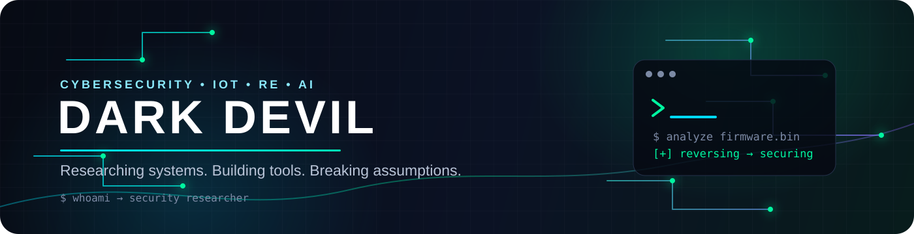

<div align="center">



<p>
  <a href="https://github.com/DarkDevil-5439">
    
  </a>
  <a href="https://t.me/talk_with_hackers">
    
  </a>
  
</p>

<p><strong>Cybersecurity Researcher · IoT & Firmware Security · Reverse Engineering · AI/ML</strong></p>

<em>“Break things. Understand why. Build them stronger.”</em>

</div>

---

## 👋 About Me

I'm **Dark Devil**, a security-focused developer and researcher who enjoys working where **software, hardware, networks, and AI** meet.

My work and learning currently revolve around **IoT security, firmware analysis, reverse engineering, network security, CTFs, computer vision, and security automation**.

```text
Focus
├── Cybersecurity & Security Research
├── IoT / Embedded / Firmware Security
├── Reverse Engineering & Binary Analysis
├── CTFs / OSINT / Web Security
├── AI/ML for Security & Computer Vision
└── Developer Tooling
```

---

## ⚙️ Tech Stack

### Security

<p>


</p>

### Languages

<p>

</p>

### Web / Backend

<p>

</p>

### Databases / Cloud / Tools

<p>

</p>

---

## 📊 GitHub

<div align="center">

<table>
<tr>
<td width="50%" align="center">


</td>
<td width="50%" align="center">


</td>
</tr>
</table>

<br/>


</div>

---

## 📈 Contribution Activity

<div align="center">


</div>

---

## 🚀 Featured Work

<table>
<tr>
<td width="50%" valign="top">

### 🛰️ Sentinel Gujarat CCTV

A security-focused CCTV platform combining **GIS camera mapping, live feeds, computer vision, and event monitoring**.

**Stack:** `Next.js` · `FastAPI` · `PostgreSQL` · `PostGIS` · `AI/ML`

</td>
<td width="50%" valign="top">

### 🧬 Firmware Security Lab

Research workflows for **firmware extraction, filesystem analysis, emulation, and vulnerability research**.

**Stack:** `Binwalk` · `Firmadyne` · `QEMU` · `angr` · `Ghidra`

</td>
</tr>

<tr>
<td width="50%" valign="top">

### 🤖 Cybersecurity LLM

Experiments with a **cybersecurity-focused language model** and GPU-accelerated training workflows.

**Stack:** `Python` · `PyTorch` · `CUDA` · `LLM`

</td>
<td width="50%" valign="top">

### 🔬 Security Research

Hands-on research across **web security, network security, OSINT, binary analysis, CTFs, and IoT security**.

**Focus:** `Research` · `CTF` · `Reverse Engineering`

</td>
</tr>
</table>

---

## 🏆 Highlights

<div align="center">

| Achievement | Area |
|:--|:--|
| 🥇 **1st Prize — DRDO Sampada 2025** | IoT Security Research |
| 📚 **Cybersecurity / IoT Research Work** | Academic & Applied Security |
| 🏴 **CTF Experience** | Web · Android · Forensics · Firmware |

</div>

---

## 🎯 Current Focus

<div align="center">

```text
SOFTWARE
    ↓
NETWORKS
    ↓
EMBEDDED DEVICES
    ↓
FIRMWARE
    ↓
AI / AUTOMATION
    ↓
SECURE SYSTEMS
```

</div>

I'm especially interested in building practical systems that connect **cybersecurity + hardware + AI**.

---

## 🌐 Connect

<div align="center">

<a href="https://github.com/DarkDevil-5439">

</a>
<a href="https://t.me/talk_with_hackers">

</a>

</div>

---

<div align="center">

### ⚡ Build. Break. Learn. Secure.


</div>
